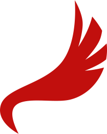
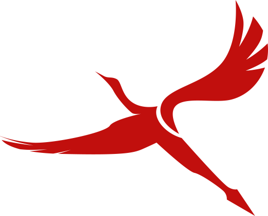

# Wing 

A strongly and statically typed toy programming language (WIP)

# Goals
* Static typing
* Strong typing
* Fast compile times
* Self hosting
* C like syntax
* Focus on data orientation
* Hook into LLVM
* Multiple returns
* Tail recursion
* Simple 1 way syntax
* For me to learn more about the compiler stack

# Logo

Official logo created by [Shubwub](https://github.com/Shubwub)

Full Logo | Minimised Logo
------------ | -------------
|
